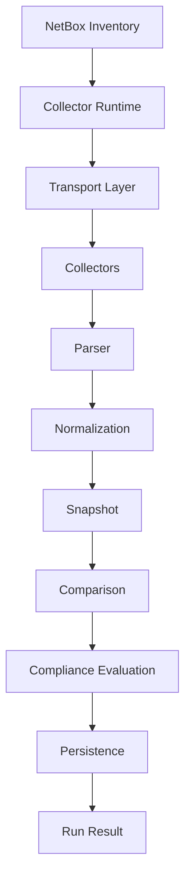

# End-to-End Orchestration Engine

Milestone 15 composes the existing platform modules into one executable
workflow. The orchestration engine contains no business rules; it coordinates
dependencies through explicit injection.

## Workflow

## Components

- `OrchestrationEngine` creates and executes jobs.
- `WorkflowEngine` coordinates the full pipeline.
- `DiscoveryCoordinator` runs collector runtime jobs and merges live snapshots.
- `OrchestrationContext` carries policies, exceptions, collector contexts,
  metadata, cancellation, event publisher, and progress callback.
- `OrchestrationState` tracks pending, running, retrying, succeeded, failed, and
  cancelled states.
- `OrchestrationResult` aggregates NetBox inventory, live snapshot, comparison
  result, evaluation decision, persistence identifiers, and metrics.

## Reliability

- Cancellation is cooperative through `CancellationToken`.
- Retries wrap the full workflow attempt.
- Progress callbacks fire before and after each major step.
- Event publishing emits run started, progress, succeeded, failed, and cancelled
  events.
- Failure recovery returns a failed result instead of leaking partial state to
  callers.

## Boundaries

The orchestration engine does not implement:

- REST APIs
- Web UI
- Reports
- Scheduling
- Notifications
- Business rules

## Performance Considerations

- Live snapshots from multiple collector jobs are merged in memory.
- Persistence happens once after comparison and evaluation complete.
- The workflow is sequential by default; future milestones can add parallel
  collector submission without changing the result model.

## Testing

Tests use mocked transports/collector runtime and an in-memory SQLAlchemy
database. Coverage includes golden workflow execution, retry handling, pipeline
failure handling, and cancellation.
